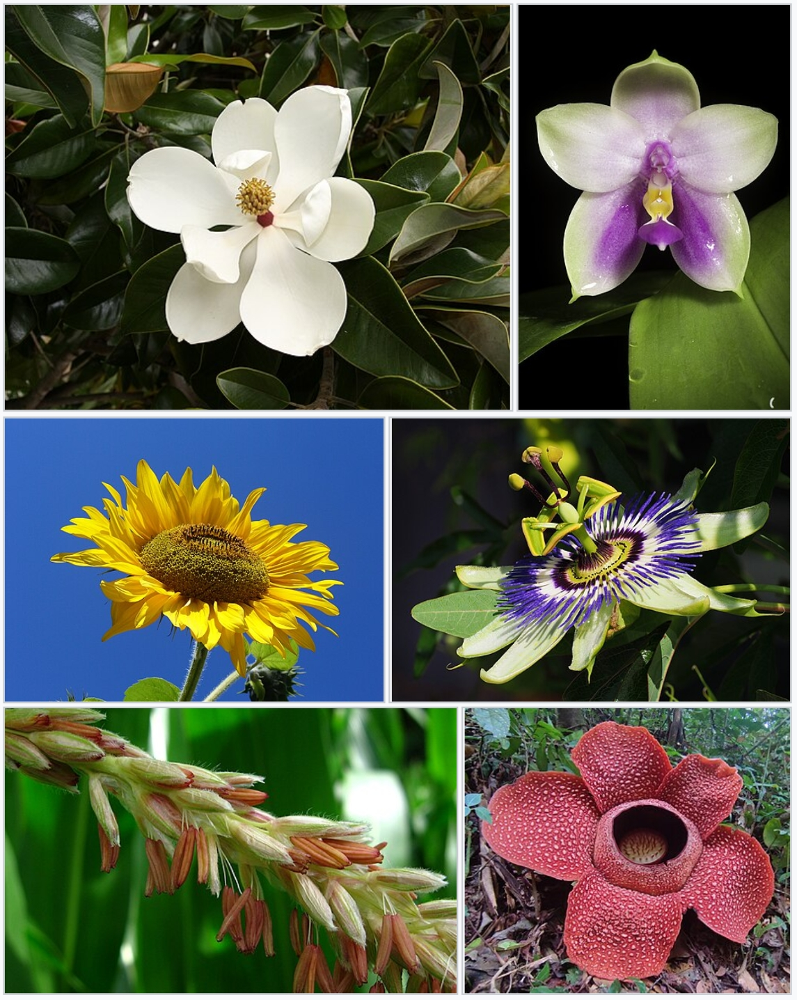

# plant_identify-game
A small game for plant enthusiast!

This document will record my entire learning process of creating this game and introduce how to play it!
# 植物识别小游戏 - 第一步

这是一个静态网页雏形，适合初学者继续扩展。

### 1. Chatgpt搭建了网站的雏形

当前包含
- `index.html`：网页结构
- `style.css`：网页样式
- `script.js`：简单按钮交互

### 2. 创建图片文件夹

在 plant-game-step1 文件夹里面，新建一个文件夹`images`：

### 3. 展示第一张图片
将第一张植物图片`0001-rose.jpg`放入`images`
此时结构变成：
```
plant-game-step1/
├── index.html
├── style.css
├── script.js
├── README.md
└── images/
    └── 0001-rose.jpg
```
打开 style.css，在里面加上这一段：
```
.plant-image {
  width: 100%;
  height: 100%;
  object-fit: cover;
  display: block;
}
```
### 4. 在图片旁边添加四个答案选项按钮。

这一阶段先只做“按钮显示出来”，暂时不判断对错。

打开 `index.html`

找到右侧说明区域里的这段：

```html
<ul class="feature-list">
  <li>展示植物图片区域</li>
  <li>显示游戏标题与说明</li>
  <li>预留开始游戏按钮</li>
  <li>为后续答题功能保留结构</li>
</ul>

<button id="startButton" class="primary-button" type="button">
  开始游戏
</button>
```

把它替换成下面这段：

```html
<div class="question-area">
  <p class="question-text">这张图片中的植物是？</p>

  <div class="answer-grid">
    <button class="answer-button" type="button">玫瑰</button>
    <button class="answer-button" type="button">月季</button>
    <button class="answer-button" type="button">牡丹</button>
    <button class="answer-button" type="button">山茶</button>
  </div>
</div>

<button id="startButton" class="primary-button" type="button">
  开始游戏
</button>
```

这样页面上就会出现一个问题和四个选项按钮。

打开 `style.css`

在 `style.css` 里添加下面这段样式。建议放在 `.feature-list` 那一段附近，或者直接放在文件末尾也可以。

```css
.question-area {
  margin: 24px 0;
}

.question-text {
  margin: 0 0 14px;
  font-size: 1.15rem;
  font-weight: 700;
  color: #26382b;
}

.answer-grid {
  display: grid;
  grid-template-columns: repeat(2, 1fr);
  gap: 12px;
}

.answer-button {
  border: 1px solid #b8ceb0;
  border-radius: 14px;
  padding: 14px 16px;
  background: #f8fbf6;
  color: #243326;
  font-size: 1rem;
  font-weight: 600;
  cursor: pointer;
}

.answer-button:hover {
  background: #e8f3e2;
  border-color: #7da66c;
}

.answer-button:active {
  transform: scale(0.98);
}
```

这会让四个按钮以 2×2 的形式排列。

### 5. 用户点击四个答案按钮后，网页能显示“回答正确”或“回答错误”**。

这里先假设你的当前图片是 `rose.jpg`，正确答案是：**玫瑰**。

修改 `index.html`

找到你的四个答案按钮：

```html
<button class="answer-button" type="button">玫瑰</button>
<button class="answer-button" type="button">月季</button>
<button class="answer-button" type="button">牡丹</button>
<button class="answer-button" type="button">山茶</button>
```

改成下面这样：

```html
<button class="answer-button" type="button" data-answer="玫瑰">玫瑰</button>
<button class="answer-button" type="button" data-answer="月季">月季</button>
<button class="answer-button" type="button" data-answer="牡丹">牡丹</button>
<button class="answer-button" type="button" data-answer="山茶">山茶</button>
```

这里新增了 `data-answer` 属性。
它的作用是让 JavaScript 知道用户点击的是哪个答案。

修改 `script.js`

打开 `script.js`，把原来的内容全部替换成下面这段：

```javascript
const startButton = document.querySelector("#startButton");
const statusText = document.querySelector("#statusText");
const answerButtons = document.querySelectorAll(".answer-button");

// 当前题目的正确答案
const correctAnswer = "玫瑰";

startButton.addEventListener("click", () => {
  statusText.textContent = "当前状态：游戏已开始，请选择一个答案。";

  answerButtons.forEach((button) => {
    button.disabled = false;
    button.classList.remove("correct", "wrong");
  });
});

answerButtons.forEach((button) => {
  button.addEventListener("click", () => {
    const userAnswer = button.dataset.answer;

    if (userAnswer === correctAnswer) {
      statusText.textContent = "回答正确：这张图片中的植物是玫瑰。";
      button.classList.add("correct");
    } else {
      statusText.textContent = `回答错误：你选择的是 ${userAnswer}，正确答案是 ${correctAnswer}。`;
      button.classList.add("wrong");
    }

    answerButtons.forEach((btn) => {
      btn.disabled = true;

      if (btn.dataset.answer === correctAnswer) {
        btn.classList.add("correct");
      }
    });
  });
});
```

这段代码会完成几件事：

```text
读取用户点击的答案
和正确答案进行比较
显示正确或错误提示
把正确答案按钮标成正确状态
答题后禁止重复点击
```

修改 `style.css`

在 `style.css` 文件末尾添加下面这段：

```css
.answer-button.correct {
  background: #dff3d8;
  border-color: #4d9340;
  color: #23551d;
}

.answer-button.wrong {
  background: #f8dddd;
  border-color: #c35a5a;
  color: #7a2424;
}

.answer-button:disabled {
  cursor: not-allowed;
  opacity: 0.9;
}
```

这样用户点击后：

```text
正确答案会变成绿色
错误答案会变成红色
答题后按钮不能继续乱点
```

### 6. 将答题模式修改为填空题，需要填写正确的物种名称才能答对
修改 `index.html`

找到你现在的这一段：

```html
<div class="question-area">
  <p class="question-text">这张图片中的植物是？</p>

  <div class="answer-grid">
    <button class="answer-button" type="button" data-answer="玫瑰">玫瑰</button>
    <button class="answer-button" type="button" data-answer="月季">月季</button>
    <button class="answer-button" type="button" data-answer="牡丹">牡丹</button>
    <button class="answer-button" type="button" data-answer="山茶">山茶</button>
  </div>
</div>
```

把它替换成：

```html
<div class="question-area">
  <p class="question-text">这张图片中的植物是？</p>

  <div class="input-area">
    <input
      id="answerInput"
      class="answer-input"
      type="text"
      placeholder="请输入植物物种名称"
      autocomplete="off"
    />

    <button id="submitAnswerButton" class="submit-button" type="button">
      提交答案
    </button>
  </div>

  <p class="input-tip">
    提示：请输入完整的物种名称，例如“玫瑰”。
  </p>
</div>
```

修改 `style.css`

你之前添加过这些样式：

```css
.answer-grid { ... }
.answer-button { ... }
.answer-button:hover { ... }
.answer-button:active { ... }
.answer-button.correct { ... }
.answer-button.wrong { ... }
.answer-button:disabled { ... }
```

这些是选择题按钮样式，现在可以保留，也可以删除。
为了填空题效果更清楚，在 `style.css` 文件末尾加入下面这段：

```css
.input-area {
  display: flex;
  gap: 12px;
  margin-top: 14px;
}

.answer-input {
  flex: 1;
  border: 1px solid #b8ceb0;
  border-radius: 14px;
  padding: 14px 16px;
  background: #f8fbf6;
  color: #243326;
  font-size: 1rem;
  outline: none;
}

.answer-input:focus {
  border-color: #4d9340;
  box-shadow: 0 0 0 3px rgba(77, 147, 64, 0.15);
}

.submit-button {
  border: 0;
  border-radius: 14px;
  padding: 14px 20px;
  background: #3f7f37;
  color: #ffffff;
  font-size: 1rem;
  font-weight: 700;
  cursor: pointer;
  white-space: nowrap;
}

.submit-button:hover {
  background: #336a2d;
}

.submit-button:disabled {
  cursor: not-allowed;
  opacity: 0.7;
}

.input-tip {
  margin-top: 10px;
  color: #68766a;
  font-size: 0.9rem;
}

.answer-input.correct {
  border-color: #4d9340;
  background: #f1faee;
}

.answer-input.wrong {
  border-color: #c35a5a;
  background: #fff0f0;
}

@media (max-width: 560px) {
  .input-area {
    flex-direction: column;
  }

  .submit-button {
    width: 100%;
  }
}
```

这段样式会让输入框和提交按钮横向排列，在手机屏幕上自动变成上下排列。

修改 `script.js`

打开 `script.js`，把原来的内容全部替换成下面这段：

```javascript
const startButton = document.querySelector("#startButton");
const statusText = document.querySelector("#statusText");
const answerInput = document.querySelector("#answerInput");
const submitAnswerButton = document.querySelector("#submitAnswerButton");

// 当前题目的正确答案
const correctAnswer = "玫瑰";

startButton.addEventListener("click", () => {
  statusText.textContent = "当前状态：游戏已开始，请输入植物名称。";

  answerInput.value = "";
  answerInput.disabled = false;
  submitAnswerButton.disabled = false;

  answerInput.classList.remove("correct", "wrong");
  answerInput.focus();
});

submitAnswerButton.addEventListener("click", () => {
  checkAnswer();
});

answerInput.addEventListener("keydown", (event) => {
  if (event.key === "Enter") {
    checkAnswer();
  }
});

function checkAnswer() {
  const userAnswer = answerInput.value.trim();

  if (userAnswer === "") {
    statusText.textContent = "请先输入答案。";
    return;
  }

  if (userAnswer === correctAnswer) {
    statusText.textContent = `回答正确：这张图片中的植物是 ${correctAnswer}。`;
    answerInput.classList.add("correct");
    answerInput.classList.remove("wrong");
  } else {
    statusText.textContent = `回答错误：你输入的是 ${userAnswer}，正确答案是 ${correctAnswer}。`;
    answerInput.classList.add("wrong");
    answerInput.classList.remove("correct");
  }

  answerInput.disabled = true;
  submitAnswerButton.disabled = true;
}
```

`trim()` 的作用是去掉用户输入前后的空格。

### 7. 准备多张植物图片，并让网页每次随机显示一题。

准备多张植物图片

在你的 `images` 文件夹里放入多张植物图片。

修改 `index.html` 里的图片标签

你现在的图片标签可能类似这样：

```html id="tzym9s"

```

把它改成：

```html id="5bhaj3"

```

这里只是新增了：

```html id="90qa6t"
id="plantImage"
```

作用是让 JavaScript 可以控制这张图片，让它随机切换成不同植物图片。

修改 `script.js`

打开 `script.js`，把原来的内容全部替换成下面这段：

```javascript id="7r38m8"
const startButton = document.querySelector("#startButton");
const statusText = document.querySelector("#statusText");
const answerInput = document.querySelector("#answerInput");
const submitAnswerButton = document.querySelector("#submitAnswerButton");
const plantImage = document.querySelector("#plantImage");

// 植物题库
const questions = [
  {
    image: "images/rose.jpg",
    answer: "玫瑰"
  },
  {
    image: "images/lotus.jpg",
    answer: "荷花"
  },
  {
    image: "images/sunflower.jpg",
    answer: "向日葵"
  },
  {
    image: "images/peony.jpg",
    answer: "牡丹"
  }
];

// 当前题目
let currentQuestion = null;

// 记录上一题的位置，尽量避免连续抽到同一题
let lastQuestionIndex = -1;

// 初始状态
answerInput.disabled = true;
submitAnswerButton.disabled = true;

startButton.addEventListener("click", () => {
  loadRandomQuestion();
});

submitAnswerButton.addEventListener("click", () => {
  checkAnswer();
});

answerInput.addEventListener("keydown", (event) => {
  if (event.key === "Enter") {
    checkAnswer();
  }
});

function loadRandomQuestion() {
  let randomIndex = Math.floor(Math.random() * questions.length);

  if (questions.length > 1) {
    while (randomIndex === lastQuestionIndex) {
      randomIndex = Math.floor(Math.random() * questions.length);
    }
  }

  lastQuestionIndex = randomIndex;
  currentQuestion = questions[randomIndex];

  plantImage.src = currentQuestion.image;
  plantImage.alt = "请识别这张植物图片";

  answerInput.value = "";
  answerInput.disabled = false;
  submitAnswerButton.disabled = false;

  answerInput.classList.remove("correct", "wrong");
  answerInput.focus();

  statusText.textContent = "当前状态：请观察图片，并输入植物物种名称。";
  startButton.textContent = "换一题";
}

function checkAnswer() {
  if (currentQuestion === null) {
    statusText.textContent = "请先点击“开始游戏”。";
    return;
  }

  const userAnswer = answerInput.value.trim();
  const correctAnswer = currentQuestion.answer;

  if (userAnswer === "") {
    statusText.textContent = "请先输入答案。";
    return;
  }

  if (userAnswer === correctAnswer) {
    statusText.textContent = `回答正确：这张图片中的植物是 ${correctAnswer}。`;
    answerInput.classList.add("correct");
    answerInput.classList.remove("wrong");
  } else {
    statusText.textContent = `回答错误：你输入的是 ${userAnswer}，正确答案是 ${correctAnswer}。`;
    answerInput.classList.add("wrong");
    answerInput.classList.remove("correct");
  }

  answerInput.disabled = true;
  submitAnswerButton.disabled = true;
}
```

修改题库内容

重点看这部分：

```javascript id="jf9dtw"
const questions = [
  {
    image: "images/rose.jpg",
    answer: "玫瑰"
  },
  {
    image: "images/lotus.jpg",
    answer: "荷花"
  },
  {
    image: "images/sunflower.jpg",
    answer: "向日葵"
  },
  {
    image: "images/peony.jpg",
    answer: "牡丹"
  }
];
```

你需要根据自己的真实图片修改它。

例如你的图片是：

```text id="cir31b"
maple.jpg
bamboo.jpg
orchid.jpg
```

那么题库就应该写成：

```javascript id="24agr2"
const questions = [
  {
    image: "images/maple.jpg",
    answer: "枫树"
  },
  {
    image: "images/bamboo.jpg",
    answer: "竹子"
  },
  {
    image: "images/orchid.jpg",
    answer: "兰花"
  }
];
```

注意：
`image` 里的文件名必须和 `images` 文件夹里的真实文件名完全一致。

### 8. 网页刚打开时先显示一张无关的初始图片，点击“开始游戏”后才随机显示植物题目图片。

准备一张初始图片

在 `images` 文件夹里放一张不用于答题的图片，例如：

```text
cover.jpg
```
修改 `index.html`

找到你的图片标签，可能是：

```html

```

把它改成：

```html

```

这样网页刚打开时，会先显示 `cover.jpg`，而不是植物题目图片。

修改初始状态文字

在 `script.js` 里找到这几行：

```javascript
// 初始状态
answerInput.disabled = true;
submitAnswerButton.disabled = true;
```

### 9. 增加计分体系，修改抽题逻辑

 修改 `index.html`

在你的填空题区域下面，加入一个计分显示区。

找到类似这一段：

```html
<div class="question-area">
  <p class="question-text">这张图片中的植物是？</p>

  <div class="input-area">
    <input
      id="answerInput"
      class="answer-input"
      type="text"
      placeholder="请输入植物物种名称"
      autocomplete="off"
    />

    <button id="submitAnswerButton" class="submit-button" type="button">
      提交答案
    </button>
  </div>

  <p class="input-tip">
    提示：请输入完整的物种名称，例如“玫瑰”。
  </p>
</div>
```

在这段后面加入：

```html
<div class="score-board">
  <p id="scoreText">当前得分：0</p>
  <p id="progressText">答题进度：0 / 0</p>
</div>
```

修改 `style.css`

在 `style.css` 文件末尾加入下面这段：

```css
.score-board {
  display: flex;
  gap: 12px;
  flex-wrap: wrap;
  margin: 18px 0;
}

.score-board p {
  margin: 0;
  padding: 10px 14px;
  border-radius: 999px;
  background: #eef6ea;
  color: #31552d;
  font-weight: 700;
  border: 1px solid #cfe2c6;
}
```

这样页面会显示两个小标签：

```text
当前得分：0
答题进度：0 / 4
```

替换 `script.js`

打开 `script.js`，把原来的内容全部替换成下面这版。

注意：你只需要根据自己的图片修改 `questions` 题库部分。

```javascript
const startButton = document.querySelector("#startButton");
const statusText = document.querySelector("#statusText");
const answerInput = document.querySelector("#answerInput");
const submitAnswerButton = document.querySelector("#submitAnswerButton");
const plantImage = document.querySelector("#plantImage");
const scoreText = document.querySelector("#scoreText");
const progressText = document.querySelector("#progressText");

// 植物题库
const questions = [
  {
    image: "images/rose.jpg",
    answer: "玫瑰"
  },
  {
    image: "images/lotus.jpg",
    answer: "荷花"
  },
  {
    image: "images/sunflower.jpg",
    answer: "向日葵"
  },
  {
    image: "images/peony.jpg",
    answer: "牡丹"
  }
];

// 当前题目
let currentQuestion = null;

// 当前得分
let score = 0;

// 已答题数量
let answeredCount = 0;

// 剩余题目索引池
// 这里保存还没有被抽到的题目编号
let remainingQuestionIndexes = [];

// 初始状态
answerInput.disabled = true;
submitAnswerButton.disabled = true;
statusText.textContent = "当前状态：点击“开始游戏”后开始识别植物。";

resetQuestionPool();
updateScoreBoard();

startButton.addEventListener("click", () => {
  if (answeredCount >= questions.length) {
    resetGame();
  }

  loadRandomQuestion();
});

submitAnswerButton.addEventListener("click", () => {
  checkAnswer();
});

answerInput.addEventListener("keydown", (event) => {
  if (event.key === "Enter") {
    checkAnswer();
  }
});

function resetQuestionPool() {
  remainingQuestionIndexes = questions.map((question, index) => index);
}

function resetGame() {
  score = 0;
  answeredCount = 0;
  currentQuestion = null;
  resetQuestionPool();
  updateScoreBoard();

  statusText.textContent = "当前状态：新一轮游戏开始。";
  startButton.textContent = "开始游戏";
}

function loadRandomQuestion() {
  if (remainingQuestionIndexes.length === 0) {
    endGame();
    return;
  }

  const randomPoolIndex = Math.floor(Math.random() * remainingQuestionIndexes.length);
  const questionIndex = remainingQuestionIndexes[randomPoolIndex];

  // 从剩余题目池中删除已经抽到的题目
  remainingQuestionIndexes.splice(randomPoolIndex, 1);

  currentQuestion = questions[questionIndex];

  plantImage.src = currentQuestion.image;
  plantImage.alt = "请识别这张植物图片";

  answerInput.value = "";
  answerInput.disabled = false;
  submitAnswerButton.disabled = false;

  answerInput.classList.remove("correct", "wrong");
  answerInput.focus();

  statusText.textContent = "当前状态：请观察图片，并输入植物物种名称。";
  startButton.textContent = "换一题";
}

function checkAnswer() {
  if (currentQuestion === null) {
    statusText.textContent = "请先点击“开始游戏”。";
    return;
  }

  const userAnswer = answerInput.value.trim();
  const correctAnswer = currentQuestion.answer;

  if (userAnswer === "") {
    statusText.textContent = "请先输入答案。";
    return;
  }

  if (userAnswer === correctAnswer) {
    score = score + 1;
    statusText.textContent = `回答正确：这张图片中的植物是 ${correctAnswer}。`;
    answerInput.classList.add("correct");
    answerInput.classList.remove("wrong");
  } else {
    statusText.textContent = `回答错误：你输入的是 ${userAnswer}，正确答案是 ${correctAnswer}。`;
    answerInput.classList.add("wrong");
    answerInput.classList.remove("correct");
  }

  answeredCount = answeredCount + 1;
  updateScoreBoard();

  answerInput.disabled = true;
  submitAnswerButton.disabled = true;
  currentQuestion = null;

  if (answeredCount >= questions.length) {
    endGame();
  }
}

function updateScoreBoard() {
  scoreText.textContent = `当前得分：${score}`;
  progressText.textContent = `答题进度：${answeredCount} / ${questions.length}`;
}

function endGame() {
  answerInput.disabled = true;
  submitAnswerButton.disabled = true;

  statusText.textContent = `本轮游戏结束：你的最终得分是 ${score} / ${questions.length}。`;
  startButton.textContent = "重新开始";
}
```

# 植物识别小游戏 - 第二步
当前已经在本地成功搭建了网站并且能够正常运行，接下来需要把这个网站搬到github上
